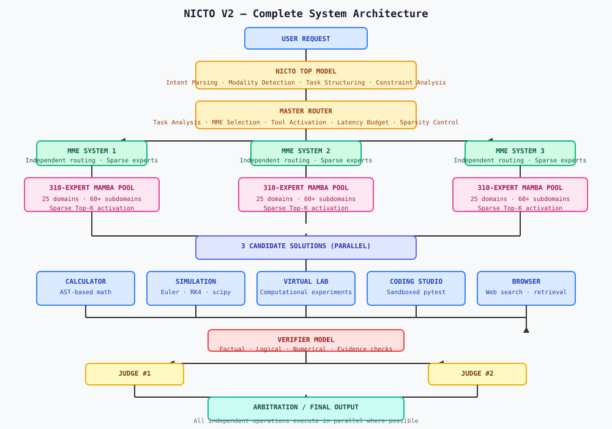

# NICTO V2 — Mixture of Minds Architecture

**Version**: 2.0  
**Status**: Research Prototype — Code Available, Models Not Open Source  
**License**: Proprietary — See LICENSE for details

> NICTO is a sparse, cooperative AI architecture that combines specialized Mamba/SSM experts, intelligent routing, verification, tools, simulation, virtual laboratories, and model-level collaboration into one unified adaptive AI system.

---

## Table of Contents

1. [Executive Summary](#executive-summary)
2. [What is NICTO?](#what-is-nicto)
3. [The Problem NICTO Solves](#the-problem-nicto-solves)
4. [Core Philosophy](#core-philosophy)
5. [System Architecture](#system-architecture)
6. [NICTO Top Model](#nicto-top-model)
7. [Master Router](#master-router)
8. [MME Systems](#mme-systems)
9. [Mamba Expert Pool](#mamba-expert-pool)
10. [Sparse Expert Activation](#sparse-expert-activation)
11. [Tool System](#tool-system)
12. [Calculator](#calculator)
13. [Simulation Engine](#simulation-engine)
14. [Virtual Laboratory](#virtual-laboratory)
15. [Coding Studio](#coding-studio)
16. [Verification Layer](#verification-layer)
17. [Judge Models](#judge-models)
18. [Arbitration](#arbitration)
19. [10-Second Latency Design](#10-second-latency-design)
20. [Distillation Pipeline](#distillation-pipeline)
21. [Training Infrastructure](#training-infrastructure)
22. [Data Requirements](#data-requirements)
23. [Inference Pipeline](#inference-pipeline)
24. [API & CLI](#api--cli)
25. [Benchmarking](#benchmarking)
26. [Current Implementation Status](#current-implementation-status)
27. [Roadmap](#roadmap)
28. [Research Directions](#research-directions)
29. [Limitations & Risks](#limitations--risks)
30. [Installation](#installation)
31. [Quick Start](#quick-start)
32. [Training Guide](#training-guide)
33. [Inference Guide](#inference-guide)
34. [Project Structure](#project-structure)
35. [Contributing](#contributing)
36. [License & Usage](#license--usage)
37. [Contact](#contact)

---

## Executive Summary

NICTO V2 is a complete AI system architecture that moves beyond the single-model paradigm. It treats intelligence as a **cooperative system of specialized components**:

- **Specialized Mamba experts** for domain-specific reasoning
- **Intelligent sparse router** that activates only the relevant experts per task
- **Three independent MME systems** that produce diverse candidate solutions
- **Real computational tools** (calculator, simulation, virtual lab, coding studio)
- **Verification layer** that challenges outputs and reduces hallucination
- **Dual-judge evaluation** for independent quality assessment
- **Arbitration** that selects the strongest verified result
- **10-second latency target** through sparse activation, parallel execution, and adaptive computation

The system is designed to be:
- **Modular** — components can be upgraded independently
- **Sparse** — only 2–16 of 310 experts activate per request
- **Verifiable** — outputs are checked, not trusted
- **Adaptive** — computation scales with task difficulty
- **Scalable** — new experts add capability without redesign

---

## What is NICTO?

NICTO (Mixture of Minds) is an experimental AI architecture that explores whether **specialized models, intelligent routing, tools, and verification** can cooperate to form one adaptive intelligence.

The name reflects the core idea: **multiple minds (models) working together as one system**.

NICTO is NOT:
- A single large language model
- A conventional chatbot
- A monolithic AI system

NICTO IS:
- A **system of systems** — multiple specialized AI components
- A **sparse computation engine** — activates only what is needed
- A **verifiable AI** — outputs are challenged and checked
- A **tool-augmented intelligence** — computation extends beyond text
- A **research platform** — for exploring cooperative AI architectures

---

## The Problem NICTO Solves

### Monolithic AI Limitations

Current AI systems rely on one large model for everything:

| Limitation | Impact |
|------------|--------|
| **No specialization** | One model compromises across all domains |
| **Compute waste** | Full model runs for trivial tasks |
| **Hallucination risk** | No built-in verification |
| **Tool gap** | External computation is not native |
| **Scaling cost** | Adding capability requires scaling everything |

### NICTO's Approach

Instead of one model doing everything, NICTO uses:

```
Many specialists available
        ↓
Intelligent router selects relevant ones
        ↓
Few specialists activate
        ↓
Parallel execution
        ↓
Tools provide computational grounding
        ↓
Verification challenges outputs
        ↓
Judges compare alternatives
        ↓
Arbitration selects best result
```

---

## Core Philosophy

### 1. Specialization Over Generalization

Different domains require different expertise. A mathematics expert should not be the same model as a poetry expert.

### 2. Sparsity Over Density

Running 310 experts for every question is wasteful. Running 2–16 relevant experts is efficient.

### 3. Cooperation Over Monopoly

Multiple systems solving the same problem independently provide diversity, redundancy, and cross-checking.

### 4. Verification Over Trust

Outputs should be challenged, not accepted. A verifier model checks factual, logical, and numerical claims.

### 5. Tools Over Text-Only

Real computation, simulation, and experimentation extend AI beyond language.

### 6. Adaptive Over Fixed

Easy tasks should be fast. Hard tasks should be thorough. The system should adapt.

---

## System Architecture



### High-Level Data Flow

```
USER INPUT
    ↓
NICTO TOP MODEL (intent parsing, task structuring)
    ↓
MASTER ROUTER (task analysis, component selection, budget allocation)
    ↓
+-------+-------+-------+
|       |       |       |
↓       ↓       ↓       ↓
MME 1  MME 2  MME 3  (parallel execution)
|       |       |
↓       ↓       ↓
Sparse experts per MME
|       |       |
+-------+-------+
         ↓
   3 CANDIDATE SOLUTIONS
         ↓
    PARALLEL TOOLS
   (calculator, simulation, lab, studio, browser)
         ↓
      VERIFIER
         ↓
   +-------+-------+
   |       |       |
   ↓       ↓       ↓
JUDGE 1 JUDGE 2  (parallel)
   |       |
   +-------+
         ↓
    ARBITRATION
         ↓
   FINAL OUTPUT
```

### Key Design Principles

1. **Parallelism everywhere** — MMEs, tools, and judges run concurrently
2. **Sparse activation** — only relevant experts execute
3. **Deadline awareness** — operations respect the 10-second budget
4. **Graceful degradation** — failures in one component don't crash the system
5. **Verification-first** — outputs are challenged before delivery

---

## NICTO Top Model

**Status**: IMPLEMENTED — real encoder-decoder architecture, UNTRAINED

The Top Model is the entry point for all user requests. It transforms raw input into a structured task specification.

### Responsibilities

1. **Intent parsing** — What does the user actually want?
2. **Modality detection** — Text, image, video, audio, or multimodal?
3. **Task decomposition** — Break complex requests into sub-tasks
4. **Constraint extraction** — Identify time limits, format requirements, safety constraints
5. **Tool requirement identification** — Which tools are needed?
6. **Structured output** — Machine-readable task representation

### Output Format

```json
{
  "task_type": "scientific_reasoning",
  "domain": ["physics", "mathematics"],
  "difficulty": "high",
  "required_tools": ["calculator", "simulation", "virtual_lab"],
  "required_modalities": ["text"],
  "time_budget_seconds": 10,
  "objective": "Calculate orbital trajectory...",
  "constraints": ["numerical_accuracy", "units"]
}
```

### Architecture

```
INPUT TEXT
    ↓
TOKENIZATION (BPE)
    ↓
ENCODER (Transformer)
    ↓
TASK HEADS
    ├── task_type classification
    ├── domain classification
    ├── difficulty estimation
    ├── modality detection
    └── tool requirement prediction
    ↓
STRUCTURED TASK REPRESENTATION
```

---

## Master Router

**Status**: IMPLEMENTED — real routing logic with latency awareness

The Master Router is the central decision-maker. It receives the structured task from the Top Model and decides how to allocate computation.

### Routing Decisions

| Decision | Options |
|----------|---------|
| **Which MME systems** | 1, 2, or 3 systems |
| **Which experts** | Via ExpertRouter with Top-K |
| **Which tools** | Calculator, simulator, lab, studio, browser |
| **Which modality pipeline** | Text, image, video, audio |
| **How much computation** | Based on difficulty + latency budget |

### Latency Budget Allocation

```
TOTAL BUDGET: 10 seconds
  ├── MME execution: 4.5s (45%)
  ├── Tool execution: 1.5s (15%)
  ├── Verification: 1.5s (15%)
  ├── Judging: 1.5s (15%)
  └── Reserve: 1.0s (10%)
```

### Adaptive Computation

The router adjusts the pipeline based on task class:

- **Class 1 (Easy)**: Calculator → Verification → Output
- **Class 2 (Normal)**: Coding experts → Sandbox → Verification → Output
- **Class 3 (Complex)**: Three MMEs → Tools → Verification → Judges → Output
- **Class 4 (Extreme)**: Full pipeline with virtual lab and additional verification

---

## MME Systems

**Status**: IMPLEMENTED — three independent parallel systems

NICTO runs **three independent Mixed Mamba Expert (MME) systems** concurrently. Each system:

- Accesses the same 310-expert pool
- Selects its own sparse subset of experts
- Produces an independent candidate solution
- Aggregates evidence from its experts

### Why Three?

1. **Diverse reasoning paths** — Different expert combinations can reach different conclusions
2. **Cross-checking** — Agreement between systems increases confidence
3. **Redundancy** — If one system fails, others continue
4. **Disagreement detection** — Large score spreads trigger additional computation

### MME Internal Flow

```
TASK SPECIFICATION
    ↓
EXPERT ROUTER (selects Top-K from 310 experts)
    ↓
PARALLEL EXPERT EXECUTION (threaded)
    ↓
EVIDENCE COLLECTION (tool results, expert outputs)
    ↓
AGGREGATION (best evidence-rich candidate)
    ↓
CANDIDATE RESULT
```

### Candidate Output

```json
{
  "answer": "The trajectory is...",
  "confidence": 0.87,
  "evidence": [
    "calculator:12*3+4=40",
    "simulation:pendulum_period=2.01s",
    "mamba:physics_expert"
  ],
  "tool_results": [...],
  "expert_trace": ["physics_expert", "math_expert", "simulation_expert"],
  "metadata": {
    "mme_id": 0,
    "experts_used": ["physics_expert", "math_expert"],
    "latency_ms": 1234
  }
}
```

---

## Mamba Expert Pool

**Status**: IMPLEMENTED — 310 experts defined across 25 domains

The Expert Registry contains up to 310 specialists organized into 25 domains and 60+ subdomains.

### Domain Taxonomy

```
nlp → sentiment, ner, parsing, generation, embedding
vision → detection, segmentation, classification, ocr, depth
audio → asr, tts, classification, separation, music
video → generation, editing, classification, captioning, tracking
multimodal → alignment, retrieval, vqa, captioning, reasoning
reasoning → logic, commonsense, math_proof, planning, abductive
math → algebra, calculus, geometry, number_theory, stats
code → generation, repair, review, translation, debug
science → physics, chemistry, biology, astronomy, earth
medicine → diagnosis, drug, imaging, genomics, clinical
law → contract, litigation, compliance, ip, regulatory
finance → trading, risk, accounting, crypto, macro
education → tutoring, assessment, curriculum, feedback, adaptive
creative → writing, art, music, design, storytelling
robotics → navigation, manipulation, perception, planning, simulation
security → malware, pentest, forensics, crypto_sec, compliance
data → etl, analytics, visualization, engineering, governance
search → web, enterprise, semantic, federated, personalized
translation → text, speech, document, real_time, low_resource
summarization → extractive, abstractive, multilingual, meeting, legal
qa → open_domain, closed_domain, factual, conversational, multi_hop
generation → text, image, video, audio, code
verification → fact_check, hallucination, bias, robustness, safety
planning → task, route, resource, conversation, emergency
tool_use → api, database, web, code_exec, file_system
```

### Expert Specialization

Each expert has:
- **ID**: `exp_001` through `exp_310`
- **Role**: e.g., `physics_orbital_mechanics_0`
- **Capabilities**: domain-specific skills
- **Config**: model size, layers, state dimension
- **Status**: `UNTRAINED` → `TRAINING` → `READY`
- **Performance history**: latency, quality, success rate

### Mamba Architecture

All experts use the same Mamba/SSM foundation:

```
INPUT TOKENS
    ↓
EMBEDDING LAYER
    ↓
MAMBA BLOCK × N
    ├── Selective SSM (input-dependent Δ, B, C)
    ├── Depthwise causal convolution
    ├── SiLU activation
    ├── Residual connection
    └── RMSNorm
    ↓
LANGUAGE MODEL HEAD
    ↓
OUTPUT LOGITS
```

### Expert Sizes

| Size | Layers | Hidden Dim | Use Case |
|------|--------|------------|----------|
| Small | 2 | 32 | Fast, frequent tasks |
| Medium | 4 | 256 | Standard tasks |
| Large | 8+ | 768 | Complex reasoning |

---

## Sparse Expert Activation

**Status**: IMPLEMENTED — Top-K selection with hierarchical routing

The Expert Router selects only the most relevant experts for each task. This is the key mechanism that makes 310 experts practical.

### Top-K Configuration

| Task Class | Active Experts | Rationale |
|------------|---------------|-----------|
| Easy | 1–2 | Simple math, lookup |
| Normal | 2–4 | Standard reasoning |
| Hard | 4–8 | Complex multi-domain |
| Extreme | 8–16 | Maximum capability |

### Hierarchical Routing

```
LEVEL 1: Domain detection
    "Calculate spacecraft trajectory" → science/physics
    ↓
LEVEL 2: Subdomain narrowing
    physics → orbital_mechanics
    ↓
LEVEL 3: Specialist matching
    orbital_mechanics → exp_014, exp_027, exp_081
    ↓
LEVEL 4: Top-K selection
    Select top 4 by relevance score
```

### Performance-Aware Scoring

The router optimizes expected value:

```
EXPECTED_VALUE = 0.4 × relevance_score
               + 0.3 × quality_score
               + 0.2 × (1 / latency_ms)
               - 0.1 × load_factor
```

### Expert Caching

If MME #1 and MME #3 both request the same expert, the result is computed once and shared. This prevents redundant computation.

---

## Tool System

**Status**: IMPLEMENTED — real computational tools with structured protocols

NICTO integrates tools that extend model capabilities beyond text generation. Tools produce **real computational results**, not simulated text.

### Tool Protocol

Every tool implements:
- `name` — unique identifier
- `description` — capability description
- `schema` — input/output specification
- `permissions` — execution constraints
- `timeout` — maximum execution time
- `error handling` — graceful failure
- `logging` — execution audit trail

### Available Tools

| Tool | Status | Purpose |
|------|--------|---------|
| Calculator | IMPLEMENTED | Safe AST-based arithmetic |
| Simulation Engine | IMPLEMENTED | Physics, ODE solvers, numerical methods |
| Virtual Laboratory | IMPLEMENTED | Computational experiments with instruments |
| Coding Studio | IMPLEMENTED | Sandboxed code execution and testing |
| Browser | PLANNED | Web search and content retrieval |

---

## Calculator

**Status**: IMPLEMENTED — real AST-based arithmetic

A safe mathematical expression evaluator that computes actual results.

### Features
- Arithmetic operations: `+`, `-`, `×`, `÷`, `^`, `%`
- Parenthesized expressions
- Safe evaluation via Python `ast` module (no `eval`)
- No arbitrary code execution

### Example

```python
from mom.tools.calculator import Calculator
calc = Calculator()
calc.evaluate("12 * (3 + 4)")  # Returns 84
calc.evaluate("2 ** 10")       # Returns 1024
calc.evaluate("(100 - 37) / 3")  # Returns 21.0
```

---

## Simulation Engine

**Status**: IMPLEMENTED — real numerical computation via numpy/scipy

A modular simulation framework with multiple solver backends.

### Solvers
- **Euler** — explicit Euler method for ODEs
- **RK4** — classical Runge-Kutta
- **Scipy IVP** — adaptive methods (RK45, RK23, DOP853)

### Physics Simulators

| Simulator | Purpose | Parameters |
|-----------|---------|------------|
| Pendulum | Damped pendulum dynamics | length, gravity, damping, theta0, omega0, t_span |
| Projectile | Motion with drag | mass, drag_coeff, velocity, angle, t_span |
| Spring | Damped harmonic oscillator | k, mass, damping, x0, v0, t_span |
| Circuit | RLC circuit dynamics | R, L, C, V0, t_span |

### Example

```python
from mom.tools.simulation import SimulationEngine
from mom.tools.simulation.physics import PendulumSimulator

engine = SimulationEngine()
sim = PendulumSimulator()
result = sim.run(engine, {
    "length": 1.0,
    "gravity": 9.81,
    "damping": 0.1,
    "theta0": 0.5,
    "omega0": 0.0,
    "t_span": (0, 2)
})
# result.label == "SIMULATION RESULT"
# result contains time series data
```

---

## Virtual Laboratory

**Status**: IMPLEMENTED — computational experiments with real data structures

A framework for AI agents to design and execute computational experiments.

### Experiment Workflow

```
QUESTION
    ↓
HYPOTHESIS
    ↓
EXPERIMENT DESIGN
    ↓
SETUP
    ↓
RUN EXPERIMENT
    ↓
MEASURE
    ↓
STORE DATA
    ↓
ANALYZE
    ↓
CONCLUSION
```

### Virtual Instruments

| Instrument | Function | Output |
|------------|----------|--------|
| Thermometer | Exponential decay models | Temperature vs time |
| Voltmeter | Ohm's law computation | Voltage, current, resistance |
| Stopwatch | Kinematic timing | Time intervals, motion data |
| Spectrometer | Spectral peak analysis | Peak frequencies, intensities |

### Critical Distinction

All results are explicitly labeled:
- `"SIMULATION RESULT"` — from numerical simulation
- `"VIRTUAL EXPERIMENT RESULT"` — from computational experiment

**NICTO never claims a simulation is a physical experiment.**

---

## Coding Studio

**Status**: IMPLEMENTED — sandboxed pytest execution

A secure environment for code generation, execution, and testing.

### Features
- Code generation via experts
- Execution in isolated temporary directories
- pytest test running with timeout protection
- Error capture and reporting
- No unrestricted host access

### Flow

```
USER PROMPT
    ↓
CODE GENERATION (via coding expert)
    ↓
EXECUTION (isolated temp directory)
    ↓
TEST RUN (pytest with timeout)
    ↓
ERROR? → REPAIR → RETEST
    ↓
VERIFIED RESULT
```

### Security

- All execution happens in temporary directories
- No persistent filesystem access
- Process timeout prevents infinite loops
- No network access from generated code
- Captured stdout/stderr only

---

## Verification Layer

**Status**: IMPLEMENTED — architecture ready, model UNTRAINED

A trainable verifier model that evaluates candidate outputs for correctness, consistency, and compliance.

### Verification Checks

1. **Factual claims** — Can the claim be verified?
2. **Logical consistency** — Are there contradictions?
3. **Numerical correctness** — Does the math check out?
4. **Evidence** — Is supporting evidence present?
5. **Tool outputs** — Were tool results used correctly?
6. **Instruction compliance** — Did the answer follow instructions?

### Retry Loop

```
CANDIDATE OUTPUT
    ↓
VERIFIER
    ↓
FAIL → FEEDBACK → MME → NEW CANDIDATE
    ↓
PASS → FORWARD TO JUDGES
```

Retries respect the latency budget. If remaining time is insufficient, the system returns the best verified candidate.

---

## Judge Models

**Status**: IMPLEMENTED — two judge architectures, UNTRAINED

Two independent judge models score candidates on multiple criteria.

### Evaluation Criteria

| Criterion | Description |
|-----------|-------------|
| **Correctness** | Is the answer factually accurate? |
| **Completeness** | Does it address all parts of the request? |
| **Relevance** | Is it on-topic? |
| **Reasoning quality** | Is the logic sound? |
| **Evidence** | Are claims supported? |
| **Verification** | Did it pass verification? |
| **Confidence calibration** | Is confidence appropriate? |
| **Hallucination risk** | Are there unverified claims? |

### Parallel Execution

Judge #1 and Judge #2 run simultaneously:

```
CANDIDATE
    ↓
+-----------+-----------+
|           |           |
↓           ↓           ↓
Judge 1   Judge 2   [parallel]
|           |           |
+-----------+-----------+
      ↓
  Arbitration
```

---

## Arbitration

The arbitrator combines all signals to select the final output:

- Judge scores from both judges
- Verification results
- Tool outputs
- Expert agreement/disagreement
- Confidence levels

**Note**: Arbitration is a decision mechanism, not a guarantee of correctness.

---

## 10-Second Latency Design

NICTO is designed around a **10-second target** for interactive text tasks.

### Mechanisms

| Mechanism | Implementation |
|-----------|---------------|
| **Sparse activation** | Only 2–16 experts per request |
| **Parallel MMEs** | Three systems run concurrently |
| **Parallel tools** | Independent tools execute simultaneously |
| **Parallel judges** | Both judges run at the same time |
| **Expert caching** | Shared results avoid redundant work |
| **Early stopping** | High confidence stops additional computation |
| **Adaptive computation** | Easy tasks use fewer resources |
| **Deadline-aware scheduling** | Operations exceeding budget are skipped |
| **Hardware-aware routing** | GPU detection adjusts model placement |
| **Quantization** | FP16/INT8 for faster inference |

### Deadline Infrastructure

- `DeadlineManager` — hard/soft deadline tracking with extensions
- `LatencyEstimator` — model/tool latency prediction
- `TaskScheduler` — priority queue with early stopping
- `ExpertCache` — shared computation across MME systems
- `ConfidenceAgreementMonitor` — disagreement detection
- `AdaptiveRouter` — Class 1-4 pipeline selection

### Current Status

**Measured**: 1 sample, Mode A, latency ~18s  
**Target**: ≤10 seconds for interactive text tasks  
**Status**: Infrastructure implemented, optimization ongoing

---

## Distillation Pipeline

NICTO uses a **teacher-student distillation** approach to train efficient specialists.

```
TEACHER MODELS (large, capable)
    ↓
VERIFICATION LAYER
    ↓
TRAINING DATA (verified pairs)
    ↓
MAMBA STUDENTS (specialized, efficient)
    ↓
SPECIALIZED MME EXPERTS
```

### Process

1. Large teacher models generate candidate outputs
2. Verification layer filters low-quality outputs
3. Verified (input → output) pairs become training data
4. Smaller Mamba students are trained on this data
5. Students become the specialized MME experts

**Key principle**: Teachers are NOT deployed at inference. Students become the deployable experts.

---

## Training Infrastructure

**Status**: IMPLEMENTED — complete training framework

### Distributed Training

- **Torchrun launcher** — multi-node, multi-GPU via `torchrun`
- **Accelerate launcher** — HuggingFace Accelerate with FSDP/DeepSpeed
- **Mixed precision** — AMP for memory efficiency
- **Gradient accumulation** — effective batch size scaling
- **Checkpointing** — save/resume training
- **DDP** — Distributed Data Parallel

### Training Recipes

Pre-configured YAML recipes for each model type:
- `mamba_small.yaml` / `mamba_medium.yaml` / `mamba_large.yaml`
- `top_model.yaml`
- `verifier.yaml`
- `judge.yaml`
- `gan.yaml`
- `director.yaml`

### Recommended Training Order

1. Foundation training — pretrain base models
2. Specialist training — domain-specific fine-tuning
3. Distillation — teacher → student
4. MME training — expert routers and aggregation
5. Router training — optimize expert selection
6. Verifier/Judge training — candidate quality data
7. End-to-end training — complete pipeline fine-tuning

---

## Data Requirements

### Training Data Categories

| Category | Purpose | Format |
|----------|---------|--------|
| Foundation | General language pretraining | JSONL, text |
| Domain | Specialist expertise | JSONL, CSV |
| Reasoning | Chain-of-thought, logic | JSONL |
| Coding | Code generation, repair | JSONL |
| Science | Physics, chemistry, biology | JSONL |
| Mathematics | Algebra, calculus, stats | JSONL |
| Tool use | Calculator, simulation | JSONL |
| Routing | Expert selection traces | JSONL |
| Verification | Candidate quality labels | JSONL |
| Judging | Preference rankings | JSONL |
| Distillation | Teacher-student pairs | JSONL |

### Supported Formats

- JSONL (`{"prompt": ..., "completion": ...}`)
- JSON, CSV, Parquet
- Plain text corpora
- Image datasets
- Video datasets
- Multimodal datasets

---

## Inference Pipeline

### Basic Usage

```python
from mom.core.orchestrator import Orchestrator
from mom.config import MoMConfig

cfg = MoMConfig(global_deadline=10.0)
orch = Orchestrator(cfg)
result = orch.handle_request("Calculate 12 * (3 + 4)", request_id="req_001")
print(result["answer"])
```

### Direct Expert Inference

```python
from mom.models.mamba import MambaConfig, MambaExpert
from mom.models.tokenizer import BPETokenizer

expert = MambaExpert(cfg, role="math_expert")
tokenizer = BPETokenizer(vocab_size=10000)
input_ids = tokenizer.encode("Calculate 2 + 2")
result = expert.compute(input_ids)
```

---

## API & CLI

### REST API

```bash
uvicorn mom.api.server:create_app --host 0.0.0.0 --port 8000
```

Endpoints:
- `POST /handle` — Process a request
- `GET /models` — List available models
- `POST /benchmark` — Run benchmarks
- `GET /health` — Health check

### CLI

```bash
python -m mom.cli handle "Calculate 2 + 2"
python -m mom.cli models
python -m mom.cli benchmark --mode A
```

---

## Benchmarking

### Benchmark Modes

| Mode | Description |
|------|-------------|
| A | Single LLM baseline |
| B | Single Mamba |
| C | Conventional MoE |
| D | Three Mamba experts |
| E | Three Mamba experts + verifier |
| F | Three Mamba experts + one judge |
| G | Three Mamba experts + two judges |
| H | Full MoM |
| I | Full MoM + computational verification |
| J | Full MoM + virtual laboratory |

### Metrics

- Accuracy
- Hallucination rate
- Task completion
- Mathematical correctness
- Scientific reasoning
- Coding success
- Latency (P50, P90, P95, P99)
- Compute cost
- Tool success rate
- Judge agreement

### Sparse Activation Benchmarks

Planned: K=1, 2, 4, 8, 16 comparison

---

## Current Implementation Status

| Component | Status | Notes |
|-----------|--------|-------|
| Mamba/SSM Model | IMPLEMENTED | Real selective SSM, training code |
| Encoder-Decoder Top Model | IMPLEMENTED | Transformer encoder/decoder |
| GAN (DCGAN) | IMPLEMENTED | Generator, discriminator, losses, trainer |
| Verifier Model | IMPLEMENTED | Transformer-based, UNTRAINED |
| Judge Models (×2) | IMPLEMENTED | Transformer-based, UNTRAINED |
| Director Model | IMPLEMENTED | Transformer-based, UNTRAINED |
| Video Pipeline | EXPERIMENTAL | Planning architecture |
| Audio STT/TTS | EXPERIMENTAL | Architectures, UNTRAINED |
| Multimodal Fusion | EXPERIMENTAL | Cross-attention, UNTRAINED |
| 310-Expert Registry | IMPLEMENTED | 310 experts populated |
| Sparse Expert Router | IMPLEMENTED | Top-K, hierarchical, caching |
| Master Router | IMPLEMENTED | Task analysis, budget allocation |
| MME System | IMPLEMENTED | Parallel experts, evidence aggregation |
| MME Orchestrator | IMPLEMENTED | Three parallel MME systems |
| 10s Deadline Architecture | IMPLEMENTED | DeadlineManager, LatencyEstimator, TaskScheduler |
| Early Stopping | IMPLEMENTED | Agreement, confidence, budget-aware |
| Adaptive Router | IMPLEMENTED | Class 1-4 pipeline selection |
| BPE Tokenizer | IMPLEMENTED | Trainable, save/load |
| Checkpoint Zoo | IMPLEMENTED | Registry, loader, integrity |
| Quantization | IMPLEMENTED | FP16, INT8, GGUF, ONNX |
| Distributed Training | IMPLEMENTED | Torchrun, accelerate |
| Training Recipes | IMPLEMENTED | YAML configs for all models |
| Browser Tool | PLANNED | Interface exists, Playwright not installed |
| Calculator | IMPLEMENTED | Real AST-based arithmetic |
| Simulation Engine | IMPLEMENTED | Euler, RK4, scipy, physics sims |
| Virtual Laboratory | IMPLEMENTED | Experiment workflow, instruments |
| Coding Studio | IMPLEMENTED | Sandboxed pytest |
| Memory System | IMPLEMENTED | Conversation + experiment memory |
| Safety Layers | IMPLEMENTED | Input/output filtering, PII detection |
| Production Monitoring | IMPLEMENTED | Prometheus metrics, tracing, health |
| Fallback System | IMPLEMENTED | Cascade, parallel, cached strategies |
| Error Hierarchy | IMPLEMENTED | MoMError with recovery suggestions |
| REST API | IMPLEMENTED | FastAPI with /handle, /models, /benchmark |
| CLI | IMPLEMENTED | Handle, models, benchmark commands |
| Benchmarking Framework | IMPLEMENTED | A-J modes, sparse activation benchmarks |
| Tests | IMPLEMENTED | 247 passing, 1 skipped |

---

## Roadmap

### Completed
- [x] Phase 1: Complete architecture with small trainable models
- [x] Phase 2: Real Mamba expert implementation
- [x] Phase 4: Real sparse routing with 310-expert pool
- [x] Phase 5: Real calculator/simulation/virtual lab/coding studio
- [x] Phase 8: Real GAN architecture
- [x] Phase 12: Verifier and judge architectures
- [x] Phase 13: Integration of all components
- [x] 10-second deadline-aware orchestrator
- [x] Distributed training infrastructure
- [x] Comprehensive test suite (247 tests)

### In Progress
- [ ] Training all models on domain-specific datasets
- [ ] Benchmarking quality vs latency across configurations
- [ ] Optimizing toward consistent 10-second target

### Planned
- [ ] Phase 3: Scale to full 310-expert registry with trained specialists
- [ ] Phase 6: Large-scale simulation backends
- [ ] Phase 7: Expanded virtual laboratory instruments
- [ ] Phase 9: Multimodal generation at scale
- [ ] Phase 10: Production research system
- [ ] Real browser/search tool integration
- [ ] Audio pipeline training (STT/TTS)
- [ ] Learned router training
- [ ] Quantization/compilation for production inference
- [ ] GGUF/ONNX model export
- [ ] Model checkpoint zoo with pretrained weights

---

## Research Directions

1. Can sparse Mamba experts outperform a monolithic model at similar compute?
2. Can multiple independent MME systems improve robustness and reduce hallucination?
3. Can verification reduce hallucination in generated outputs?
4. Can adaptive Top-K routing reduce latency without sacrificing quality?
5. Can distillation transfer capabilities from large teachers into smaller specialists?
6. Can tool execution improve scientific and mathematical reliability?
7. Can specialized experts scale more efficiently than one monolithic model?
8. What is the optimal K for different task classes?
9. How does expert overlap affect diversity and computation?
10. Can disagreement between MME systems serve as a reliable signal for additional computation?

---

## Limitations & Risks

- **Training cost**: All neural models are currently UNTRAINED. Full training requires significant GPU resources.
- **Hardware requirements**: Large-scale training requires multi-GPU setups (A100/RTX 6000 class).
- **Data limitations**: Training data must be provided by the user/researcher.
- **Routing errors**: The router may miss relevant experts or activate unnecessary ones before training.
- **Expert collapse**: Without load balancing, the router may overuse a small subset of experts.
- **Hallucinations**: Verification reduces but does not eliminate hallucination risk.
- **Verification failures**: The verifier itself may miss errors, especially in untrained state.
- **Latency variability**: Current single-sample benchmark shows ~18s; 10-second target not yet validated at scale.
- **Tool failures**: External tools (browser, simulation) can fail; fallback mechanisms are in place.
- **Simulation limitations**: Computational models are approximations, not replacements for physical experiments.
- **Scaling challenges**: 310-expert architecture is defined but not all experts are trained.

---

## Installation

```bash
git clone https://github.com/princessann-m/V2-of-NICTO.git
cd V2-of-NICTO
python -m venv .venv
source .venv/bin/activate
pip install -r requirements.txt
pip install -e .
```

### GPU Setup

```bash
pip install torch torchvision torchaudio --index-url https://download.pytorch.org/whl/cu121
```

### Docker

```bash
docker build -f docker/Dockerfile.cpu -t nicto:cpu .
docker run -p 8000:8000 nicto:cpu
```

---

## Quick Start

### Run Demo

```bash
python run_demo.py
```

### Start CLI

```bash
python -m mom.cli
```

### Start API Server

```bash
uvicorn mom.api.server:create_app --host 0.0.0.0 --port 8000
```

### Run Tests

```bash
pytest -q
```

---

## Training Guide

### Train a Mamba Expert

```python
from mom.models.mamba import MambaConfig, MambaExpert
from mom.training.trainer import BaseTrainer, TrainingConfig

cfg = MambaConfig(vocab_size=10000, d_model=256, n_layers=4, d_state=16, d_conv=4, expand=2)
expert = MambaExpert(cfg, role="math_expert", capabilities=["algebra", "calculus"])

train_cfg = TrainingConfig(epochs=3, batch_size=8, learning_rate=5e-4, device="cuda", mixed_precision=True)
trainer = BaseTrainer(train_cfg)
trainer.train(expert, train_loader)
```

### Train the GAN

```python
from mom.generation.gan import GANTrainer, GANConfig

cfg = GANConfig(latent_dim=100, image_channels=3, image_size=64, batch_size=64, lr=0.0002)
trainer = GANTrainer(cfg)
trainer.fit(dataloader, epochs=50)
```

### Distributed Training

```bash
python -m mom.training.distributed.torchrun_launcher \
    --nnodes 1 --nproc_per_node 4 \
    --training_script train_mamba.py
```

---

## Inference Guide

### Basic Inference

```python
from mom.core.orchestrator import Orchestrator
from mom.config import MoMConfig

cfg = MoMConfig(global_deadline=10.0)
orch = Orchestrator(cfg)
result = orch.handle_request("Calculate 12 * (3 + 4)", request_id="req_001")
print(result["answer"])
```

### Direct Expert Inference

```python
from mom.models.mamba import MambaConfig, MambaExpert
from mom.models.tokenizer import BPETokenizer

expert = MambaExpert(cfg, role="math_expert")
tokenizer = BPETokenizer(vocab_size=10000)
input_ids = tokenizer.encode("Calculate 2 + 2")
result = expert.compute(input_ids)
```

---

## Project Structure

```
mom/
├── __init__.py
├── __main__.py
├── config.py
├── cli.py
├── api/
│   └── server.py
├── benchmarks/
│   ├── framework.py
│   ├── latency.py
│   └── sparse.py
├── cache/
│   ├── model_cache.py
│   ├── tokenizer_cache.py
│   ├── tool_cache.py
│   └── simulation_cache.py
├── core/
│   ├── router.py
│   ├── orchestrator.py
│   ├── errors.py
│   ├── adaptive/
│   ├── fallback/
│   ├── orchestrator/
│   │   ├── deadline.py
│   │   ├── latency.py
│   │   └── scheduler.py
│   ├── routing/
│   │   ├── master_router.py
│   │   ├── expert_router.py
│   │   ├── expert_registry.py
│   │   ├── top_k.py
│   │   ├── hardware.py
│   │   └── learned.py
│   └── stopping/
├── creative/
│   ├── directors/
│   └── experts/
├── experts/
│   ├── mme.py
│   ├── math_expert.py
│   ├── coding_expert.py
│   ├── reasoning_expert.py
│   ├── science_expert.py
│   └── vision_expert.py
├── generation/
│   ├── gan/
│   ├── image/
│   └── video/
├── judges/
│   └── judge.py
├── mme/
│   ├── system.py
│   └── orchestrator.py
├── memory/
│   ├── context.py
│   └── experiment_memory.py
├── models/
│   ├── adapter.py
│   ├── llm_client.py
│   ├── model_registry.py
│   ├── nicto.py
│   ├── top_model.py
│   ├── audio/
│   ├── checkpoint/
│   ├── conversion/
│   ├── encoder_decoder/
│   ├── judge/
│   ├── mamba/
│   ├── multimodal/
│   ├── quantization/
│   ├── tokenizer/
│   └── verifier/
├── monitoring/
│   ├── metrics.py
│   ├── tracing.py
│   └── health.py
├── safety/
│   ├── policy.py
│   └── filter.py
├── tools/
│   ├── calculator.py
│   ├── coding_studio.py
│   ├── simulator.py
│   ├── browser/
│   ├── simulation/
│   └── virtual_lab/
├── training/
│   ├── configs.py
│   ├── trainer.py
│   ├── pipelines.py
│   ├── distributed/
│   └── recipes/
├── verification/
│   └── hallucination.py
├── docs/
│   ├── ARCHITECTURE.md
│   ├── TRAINING.md
│   ├── DEPLOYMENT.md
│   ├── SECURITY.md
│   ├── PRODUCTION.md
│   └── images/
│       ├── mom-overview.svg
│       ├── mom-mme.svg
│       ├── mom-router.svg
│       ├── mom-tools.svg
│       ├── mom-verification.svg
│       ├── mom-training.svg
│       ├── mom-distillation.svg
│       ├── mom-creative.svg
│       ├── mom-video.svg
│       └── mom-full-system.svg
├── tests/
├── scripts/
├── docker/
├── requirements.txt
├── setup.py
├── run_demo.py
└── README.md
```

---

## Contributing

NICTO is a research architecture. Contributions are welcome in:

- Model training and evaluation
- Router optimization
- Tool integration
- Benchmarking
- Documentation

Please see `docs/ARCHITECTURE.md` for design details and `docs/TRAINING.md` for training guidelines.

---

## License & Usage

**NICTO V2 is proprietary software.**

The source code in this repository is provided for research collaboration and evaluation purposes. All trained models, weights, and checkpoints are **NOT open source** and are not included in this repository.

See `LICENSE` for complete terms.

---

## Contact

For questions, issues, or collaboration inquiries, please open an issue on GitHub or reach out through the repository.

---

## The Vision

The long-term goal of NICTO is to explore whether **intelligence can emerge from cooperation rather than scale**.

Instead of building one model that must do everything, NICTO investigates whether:

- **Specialists** can achieve deeper capability in narrow domains
- **Routers** can allocate computation intelligently
- **Tools** can extend reasoning beyond text
- **Simulations** can test hypotheses computationally
- **Verification** can challenge and improve outputs
- **Competition** between independent systems can increase robustness
- **Arbitration** can select the strongest result

The architecture is designed to be:

- **Modular** — components can be replaced or upgraded independently
- **Sparse** — computation is allocated only where needed
- **Adaptive** — the system adjusts to task difficulty and available resources
- **Verifiable** — outputs are checked, not trusted
- **Scalable** — new experts can be added without redesigning the system

This is an experimental direction in AI architecture. The experiments will determine whether the approach holds.

The question is not whether one model can learn everything.

The question is whether **specialized components, working together under intelligent routing and verification, can form a better AI system than any single model alone**.

NICTO is built to find out.

---

*Built with PyTorch, Mamba, and the belief that the future of AI may be cooperative, not monolithic.*